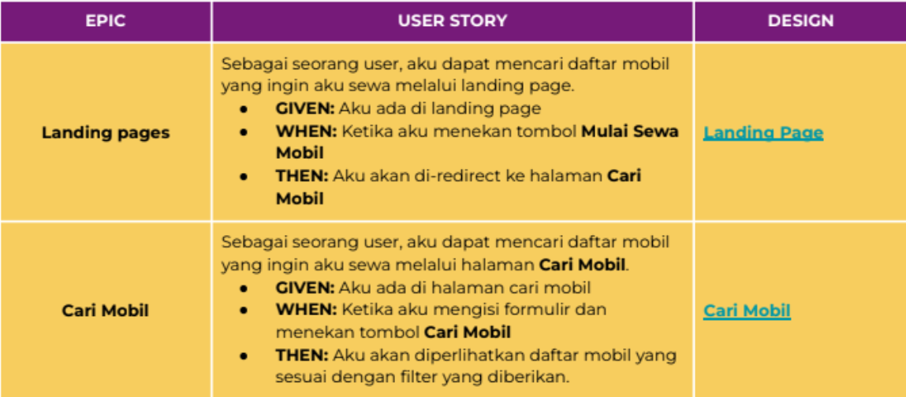

# Librarian Staff Manager

Membuat tampilan web statis pada website Binar Rental Car dengan mengimplementasikan konsep Object-Oriented Programming (OOP) dan manipulasi Document Object Model (DOM). Proses ini melibatkan penerapan prinsip OOP untuk menyusun komponen web secara modular dan terstruktur, serta memanfaatkan DOM manipulation untuk mengelola dan memodifikasi elemen-elemen HTML secara dinamis, sehingga tampilan website dapat interaktif dan responsif terhadap tindakan pengguna

## Daftar Isi

- [Tentang Proyek](#tentang-proyek)
- [Fitur](#fitur)
- [Instalasi](#instalasi)
<!-- - [Cara Penggunaan](#cara-penggunaan)
- [Kontribusi](#kontribusi) -->

## Tentang Proyek

- Membuat sebuah abstract class bernama Component
- Component punya fungsi bernama render yang mana berfungsi untuk membangun string HTML yang akan di-inject melalui DOM
- Karena Component adalah sebuah abstract class, maka harus ada implementasi dari kelas tersebut yang bernama Car



## Fitur

- **Filtering Card Mobil**:
  - Tambahkan staff baru ke dalam database dengan shift pagi atau malam.
  - Edit informasi staff yang sudah ada dengan mudah.

- **Katalog Buku**:
  - Lihat daftar buku yang tersedia di perpustakaan.

## Instalasi

Ikuti langkah-langkah berikut untuk menginstal dan menjalankan aplikasi ini di komputer Anda:

1. **Download aplikasi Binar Rental Car**:
   - Clone repositori ini atau unduh file zip dari [tautan ini](#).
   ```bash
   git clone https://github.com/NeoBitose/24001183-km7-aar-javascriptdom-ch2.git
   ```

2. **Atur Konfigurasi Server pada folder server, pilih index.js**:
   - default server nanti nya akan berjalan di localhost port 8000.

3. **Jalankan perintah npm install pada terminal folder instalasi**:
   - buka terminal dan pastikan terinstall node js, kemudian jalankan perintah diatas.

4. **Jalankan perintah npm run start pada terminal folder instalasi**:
   - setelah langkah kedua dilakukan maka jalankan perintah diatas.

5. **Buka link pada termninal, dan explore fitur yang tersedia dalam aplikasi**:
   - Jelajahi berbagai fitur filtering dan pencarian card mobil yang tersedia.

<!-- ## Cara Penggunaan

1. **Navigasi Halaman**:
   - Gunakan navbar untuk menavigasi antara halaman katalog buku, penambahan staff, dan lainnya.

2. **Menambahkan Staff**:
   - Pergi ke halaman penambahan staff, isi form yang tersedia, dan pilih shift (pagi atau malam).

3. **Mengedit Staff**:
   - Pilih staff yang ingin diedit dari daftar, lakukan perubahan yang diinginkan, lalu simpan perubahan. -->

<!-- ## Kontribusi

Daftar Anggota Dalam Repository Ini

1. **[Wahyu Anang Zulfikri](https://github.com/wahyuanang)**
2. **[Rafly Aziz Abdillah](https://github.com/raflytch)**
3. **[Ahmad Alif Ramadhan](https://github.com/neobitose)**
4. **[Gede Brandon Abelio Ogaden](https://github.com/OddDuckkk)**
5. **[Nita Fitrotul Mar'ah](https://github.com/Nitaa1904)**
6. **[Jetro Sulthan Fatih Nurrafi](https://github.com/JetroSulthan)**
7. **[Tegar Alfa Rizzi](https://github.com/TegarAlfaR)**
8. **[Muhammad Rifqi Tri Afandi](https://github.com/RifqiAfandi)** -->